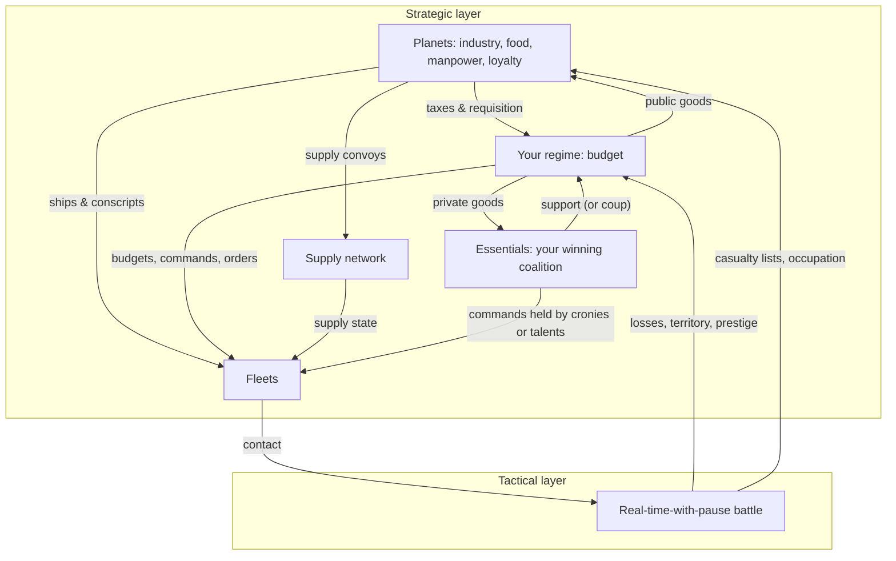

# Game Design Document — *Successor Stars* (working title)

A grand strategy game of galactic war and political survival, inspired by *Legend of the
Galactic Heroes*. Solo/small-team indie project. This is the founding design document;
sections are written to be split into separate files as they grow.

> **Status:** Draft v0.2 — 2026-07-08
> **Confirmed decisions:** real-time-with-pause battles · original setting (LoGH-inspired,
> not the licensed IP) · scoped for solo development with a strict MVP · **politics modeled
> generically via selectorate theory** — every ruler starts with a random (but balanced)
> political setup and can steer toward autocracy or democracy · single-player first,
> **designed to support competitive multiplayer later**.
>
> *v0.2 pivot:* replaced the two fixed great powers (Imperium vs. Concord) with a
> **successor-states premise** — the old empire has collapsed and every player/AI is a
> sector ruler. The previous working title *The Twin Corridors* no longer fits and was
> retired.

---

## Table of contents

1. [Vision & Pillars](#1-vision--pillars)
2. [Setting](#2-setting)
3. [Core Gameplay Loop](#3-core-gameplay-loop)
4. [Strategic Layer](#4-strategic-layer)
5. [Tactical Layer — Fleet Battles](#5-tactical-layer--fleet-battles)
6. [Commanders, Essentials & Characters](#6-commanders-essentials--characters)
7. [Campaign Structure & Victory Conditions](#7-campaign-structure--victory-conditions)
8. [Balanced Random Starts](#8-balanced-random-starts)
9. [UI/UX Sketch](#9-uiux-sketch)
10. [Art & Audio Direction](#10-art--audio-direction)
11. [Technical Approach](#11-technical-approach)
12. [MVP & Milestones](#12-mvp--milestones)
13. [Risks & Open Questions](#13-risks--open-questions)

---

## 1. Vision & Pillars

### Elevator pitch

The empire that ruled the galaxy for five centuries is dead, and its corpse is being
divided. You are one of its heirs — an admiral, a governor, a president, a pretender —
ruling a sector with whatever political machine you inherited: a junta, an oligarchy of
noble houses, a fragile republic. Keep the people who keep you in power satisfied, decide
whether to rule as a dictator or build a democracy, manage the planets that feed your
fleets — and command those fleets in real-time battles decided by formations, maneuver,
and supply. Reunify the galaxy, or be removed by the coalition you failed to pay.

### What makes it different

Most strategy games treat government as a static bonus sheet. Here, **political survival
is a game system with real theory behind it** (selectorate theory — *The Logic of
Political Survival* / *The Dictator's Handbook*): you stay in power by satisfying your
**essentials**, the small set of people whose support you cannot lose. Rule with a tiny
coalition and you can loot your planets to pay three cronies — cheap, decisive, and one
missed payment from a coup. Broaden the coalition and you must deliver public goods to
millions — expensive and slow, but planets that believe in you fight and supply like it.
The core fantasy is Reinhard *and* Yang in one system: the same rules produce the
conqueror reshaping a rotten autocracy and the reluctant democrat defending a flawed
republic — depending on how *you* steer.

### Design pillars

Every feature must serve at least one pillar. Features that serve none get cut.

1. **Battles are won by maneuver and supply, not stats.**
   A half-strength fleet with fresh supply, a good formation, and the enemy's flank will
   beat a full-strength fleet caught head-on with empty magazines. Numbers matter; position
   and logistics matter more.

2. **Every planet is a stakeholder, not a resource node.**
   Planets have populations with loyalty, grievances, and breaking points. Squeeze a world
   for ships and conscripts and it will supply you — until it doesn't. Occupied planets
   remember how they were treated.

3. **You are the leader, not the state.**
   The primary loss condition is *losing power*, not losing territory. Every regime runs on
   the same selectorate rules: pay your essentials or be replaced. Autocracy and democracy
   are not factions you pick from a menu — they are positions on a dial you inherit at
   random and steer through play, each with honest costs.

4. **Symmetric rules, asymmetric inheritances.**
   All rulers — human or AI — play by identical rules. Variety comes from randomized
   starting setups (regime shape, coalition cast, sector geography); fairness comes from
   those setups being balanced to equal total value (§8). No start is strictly stronger;
   multiplayer-ready by construction.

### Target audience & references

- Players of *Crusader Kings III*, *Hearts of Iron IV*, *Total War* campaigns, *Terra
  Invicta*, *Nebulous: Fleet Command*, *Rule the Waves*, *Suzerain*.
- Fans of military SF where logistics and politics matter: *LoGH*, *The Expanse*,
  Honor Harrington novels; readers of *The Dictator's Handbook*.
- Comfortable with depth; tolerant of indie production values; PC-first.

### Genre & platform

- **Genre:** Grand strategy with real-time-with-pause tactical battles (two-layer, like
  *Total War* but space-borne and politics-heavy).
- **Platform:** PC (Windows/Linux), mouse + keyboard. No console/mobile plans.
- **Session shape:** Campaign of 20–60 hours (score/survival victory available for shorter
  sessions); single battles playable standalone from a skirmish menu (also the dev test
  bed). **Multiplayer** (competitive campaign between sector rulers) is a post-release
  goal that constrains architecture from day one (§11) but not the MVP.

---

## 2. Setting

Original universe, deliberately parallel to LoGH's *texture* (corridor warfare, fleet
formations, politics-as-destiny) without its plot or map. All names are placeholders —
flagged `(pl.)` — and safe to change without touching mechanics.

### The Sundering

For five centuries the **Valdren Imperium** (pl.) ruled the settled galaxy. A succession
war — three claimants, twelve years, a hundred million dead — ended not with a victor but
with a bankruptcy: the fleets mutinied over pay, the corridor fortresses declared
neutrality, and the throne world burned. That was thirty years ago.

Now the galaxy is a shatter-zone of **successor sectors**. Each is ruled by whatever
seized power when the center failed: a fleet admiral turned junta chief, a cartel of noble
houses, a colonial assembly that voted itself sovereign, a customs guild with a private
navy. Every ruler claims to be restoring order. Every ruler knows there is room for only
one restoration.

**The player is one of these rulers.** So is every AI opponent (and, later, every other
human player). Nobody starts as "the empire" or "the rebels" — those are outcomes, not
setups.

### Political inheritance

Each sector begins with a randomized **regime setup** (§4.5, §8): where it sits on the
autocracy–democracy spectrum, who its essential power brokers are, and what institutional
scar tissue the Sundering left behind. A junta inherits veteran squadrons and terrified
planets; a frontier republic inherits loyal worlds and a demobilized navy. The premise is
symmetric; the inheritances are not — only their total value is (§8).

### Geography: corridor lattice

Faster-than-light travel is only stable along **corridors** — charted lanes between star
systems; the space between is impassable shoal. The galaxy is therefore a **node graph
with chokepoints**, and war is siegecraft:

- **Fortress nodes:** the old Imperium anchored key corridors with battle fortresses.
  The greatest survivor, **Bastion Helde** (pl.), guards the junction between the richest
  successor sectors — an Iserlohn analog whose main gun makes frontal assault suicidal.
  Fortresses are strategic prizes: supply superdepots and gates (§4.4, §5.7).
- **The Serapha Exchange** (pl.): a merchant city-state that survived the Sundering by
  financing all sides of it. Serapha sells intel, moves cargo through its private
  corridor, and — crucially for the political game — **extends loans that desperate
  rulers use to pay their essentials**. Debt to Serapha is a noose (post-MVP; cut-line in
  §12).
- Campaign maps: authored map for single-player (~40–60 systems, 4–8 sectors); mirrored/
  symmetric generated maps for multiplayer fairness (§8).

### Tone

Somber, humanist military drama in a warlord era. War is logistics and waste, not glory;
politics is patronage and survival, not alignment bars. Every regime type contains decent
people serving compromised systems. No aliens — the only enemy humanity has is itself.

### Scale conventions

- One "fleet" = ~10,000–15,000 ships, ~1–2 million crew. The game's smallest tactical
  unit, the **squadron**, represents ~500–1,500 ships and is rendered as a formation
  marker, not individual vessels.
- Campaign time: 1 turn-tick = 1 week (strategic layer runs in ticked real time, always
  pausable). A full campaign spans roughly 10–15 in-fiction years.

---

## 3. Core Gameplay Loop

Two layers feed each other, with the regime — your coalition and budget — as the hinge.
Neither is a minigame: losing the political game removes you from play just as surely as
losing your fleets.

**The loop in one sentence:** planets generate revenue, supply, and manpower → you split
the budget between fleets, private goods for your essentials, and public goods for your
planets → fleets project power along corridors → battle outcomes feed back as territory,
prestige, and casualty lists → prestige and casualties move essential satisfaction and
planetary loyalty → which determine what you can extract, and whether you're still in
power, next tick.

**Feedback loops we want the player to feel:**

- *Victory spiral with a catch:* winning grants prestige (cheap legitimacy for any regime)
  but also longer supply lines and ambitious essentials who now believe they could do your
  job. Overextension is how winners lose (the Amritsar/Vermillion lesson).
- *The home front bites:* every casualty comes from a specific planet's manpower pool.
  High-casualty wars crater loyalty exactly where you recruit — and in broad-coalition
  regimes, casualty-grief reaches your essentials directly.
- *The dictator's trap:* squeezing planets to pay essentials works — and hollows out the
  loyalty, manpower quality, and industry the war effort runs on. The democrat's trap is
  the mirror: public goods keep planets loyal but leave the treasury too thin for fleets,
  and one lost battle can end you at the polls.
- *Occupation is a choice:* conquered worlds can be plundered (short-term revenue, seeded
  rebellion) or courted (long-term integration, short-term cost) — and your regime type
  changes which is viable.

---

## 4. Strategic Layer

### 4.1 Galaxy map

- A **node graph**, not free 2D space: ~40–60 star systems connected by corridor lanes,
  funneling through fortress chokepoints. Node graphs are dramatically cheaper to build AI
  for and naturally produce chokepoint play. (MVP: ~12 systems, 3 sectors.)
- Each system contains 0–3 **planets** plus optional features: fortress, shipyard,
  asteroid belt (tactical terrain), listening post (intel range).
- Fleets move system-to-system along lanes; travel takes ticks proportional to lane
  length. Fleet visibility is limited by intel (see 4.6).

### 4.2 Planets

Each planet is a small dashboard of sliders and states, not a city-builder. Solo-dev rule:
**no construction queues on planets** — development changes through policies and events,
not per-building micromanagement.

**Planet attributes:**

| Attribute | What it does |
|---|---|
| **Population** | Scales everything else; shrinks with conscription and massacres |
| **Industry** | Produces *materiel* (the universal supply/repair/shipbuilding resource) and tax revenue |
| **Agriculture** | Produces *food*; fleets and planets both eat |
| **Manpower pool** | Recruits crews; drained by casualties, regrows slowly |
| **Loyalty** (0–100) | Willingness to actually deliver the above |
| **Unrest** (0–100) | Pressure toward rebellion; rises from grievances |

**Planet policies (the player's levers, set per-planet or realm-wide):**

- **Taxation / requisition level** (light → punitive): more revenue now, +unrest.
  Punitive levels are only *politically* sustainable for small-coalition regimes (§4.5) —
  broad-coalition rulers who loot their own voters bleed essential satisfaction.
- **Conscription level** (volunteer → total mobilization): more manpower, +unrest,
  −population long-term. Volunteer-only recruitment yields fewer but higher-quality crews
  (experience bonus, §5.8) and is the natural fit for high-loyalty regimes.
- **Garrison size:** suppresses unrest while stationed; garrison troops are drawn from the
  same manpower pool as fleet crews — guns vs. butter inside the military itself.
- **Occupation stance** (conquered worlds only): *plunder* / *administer* / *integrate*.

### 4.3 Loyalty, unrest & rebellion

The rebellion pipeline is deliberately legible — the player should always see it coming
and know why:

1. **Grievances** accumulate from causes shown on the planet panel: high taxation, heavy
   conscription, local casualties, food shortage, occupation by a foreign ruler, low
   public-goods spending (§4.5), a hated crony governor.
2. Grievances push **unrest** up; loyalty, garrisons, public goods, and good governance
   push it down.
3. At unrest thresholds, escalating states fire:
   - **60 – Strikes:** planet delivers 50% of revenue/materiel/food this tick.
   - **75 – Riots:** deliveries stop; garrison takes attrition; nearby planets' unrest +.
   - **90 – Rebellion:** planet flips to *rebel* control. Its stockpiles are lost, its
     system becomes hostile territory (no supply transit), and a rebel militia spawns.
     Retaking it requires a fleet + ground assault (abstracted: siege timer + manpower
     cost) and leaves a long-lasting *scorched* grievance.
4. **Rebellion is contagious:** a successful rebellion adds a grievance to culturally
   linked planets. A frontier can unzip if ignored.

Rebel planets can also **defect** to a neighboring ruler whose regime fits their
grievance profile: worlds ground down by a junta's requisitions will invite in a
broad-coalition neighbor, and planets that feel taxed to fund a distant republic's
welfare will open their ports to a strongman promising order. **Your regime shape (§4.5)
is thus also a diplomatic weapon** — being the kind of state your rival's planets would
rather belong to.

### 4.4 Supply & logistics (the heart of the strategic-military game)

**Model:** every fleet has a **supply meter** (0–100) drained by existing (slowly), moving
(moderately), and fighting (fast). Supply refills only from:

- Friendly planets/fortresses in the same system (instant, from local stockpile), or
- **Convoys** that automatically flow from stockpiles along friendly lanes to fleets.

**Rules that create the LoGH texture:**

- Convoys travel along lanes and **can be raided**. A raider fleet sitting on a supply
  lane intercepts a % of throughput per tick — commerce raiding is a real strategy, and
  escorting convoys is a real duty that ties down ships.
- Throughput falls with **distance** (each lane hop −20%) and stops entirely through
  contested or rebel systems. Deep offensives therefore starve unless you secure the whole
  chain — or deliberately plan a short, decisive lunge.
- **Supply state gates tactical performance** (exact modifiers in §5.8): a starving fleet
  fights with reduced weapon uptime and morale. This is the single most important
  strategic→tactical link in the game.
- Fortresses like Bastion Helde are supply *superdepots*: fleets based there never worry
  about supply, which is *why* corridor fortresses matter.
- **Corruption skim:** in small-coalition regimes, essentials skim a percentage of all
  materiel throughput (§4.5) — the autocrat's convoys are structurally leakier.

**Anti-frustration:** logistics is automated by default (convoys route themselves); the
player's job is to *protect* the network and to *judge* how far it can stretch, not to
click trucks.

### 4.5 Politics — the selectorate model

The political game runs on one generic model for every ruler — player, AI, and (later)
other humans. It replaces factions, alignment bars, and government-type pick-lists.

#### The three circles

Following selectorate theory, every polity has:

- **Interchangeables** — the *nominal selectorate* **S** (as % of population): everyone
  with a formal say in who rules. In a junta, S ≈ the officer corps (tiny); in a full
  republic, S ≈ the adult population.
- **Essentials** — the *winning coalition* **W**: the people whose active support keeps
  you in power *right now*. Represented concretely as **3–12 named seats** (characters or
  blocs — see below), not an abstract number. W is the game's autocracy–democracy dial:
  **W = 3** is a junta; **W = 12** is a broad democracy.
- (The theory's middle circle, *influentials*, is folded into S for simplicity — a
  deliberate solo-dev abstraction.)

At small W, seats are *individuals*: the secret police chief, the fleet commander, the
head of a noble house. At large W, seats are *blocs* representing mass constituencies:
the colonial assembly, the veterans' league, the industrial unions, the free press. Same
data structure, different portraits and different appetites (below).

#### Staying in power

Each seat has **Satisfaction** (0–100) and **Weight**. If the weighted satisfied support
of your coalition falls below the survival threshold, a **removal crisis** fires — a coup
plot in small-W regimes, a no-confidence vote or lost election in large-W ones. Removal
crises are visible, escalating event chains (like the rebellion pipeline: no gotchas),
and losing one is the primary **game over** (§7).

Satisfaction is fed by the **budget**. Each tick, revenue splits three ways on a single
slider set — the most important control in the strategic game:

- **Military budget** → fleets, shipyards, garrisons, fortress upkeep.
- **Private goods** → divided among your essential seats: stipends, monopolies, estates,
  flagship commands. Effectiveness per seat = private budget ÷ number of seats — **this
  is why small coalitions are cheap** and why broadening yours dilutes every crony's cut.
- **Public goods** → spread across your planets' populations: food security, veterans'
  care, infrastructure, low effective taxes. Lowers grievances everywhere (§4.3), raises
  volunteer manpower quality and fleet base morale — and it is the *only* thing that
  satisfies bloc-type seats, whose constituencies can't be bribed one yacht at a time.

The theory's core asymmetry thus falls out of arithmetic rather than modifiers: an
autocrat can run punitive taxation and pour it into three pockets and a war fleet; a
democrat must fund public goods that happen to also strengthen the home front. Both are
viable. Neither is comfortable.

#### The loyalty norm (the dictator's handbook toolkit)

An essential's willingness to join a plot against you scales with their **replaceability
= S ÷ W**. A large selectorate with a tiny coalition (rigged elections, a party machine
of millions eligible and three promoted) makes every essential terrified of losing their
seat — maximum loyalty, the classic machine-state. A small selectorate with a large
coalition (an aristocratic republic) makes essentials bold — *they* can't be replaced,
*you* can. The player can see each seat's replaceability and act on it.

#### Steering the regime

W and S are not fixed. Regime actions (each with costs, delays, and an **instability
window** during which crisis thresholds are lowered):

| Action | Effect | Cost / risk |
|---|---|---|
| **Purge a seat** | Remove an essential; W−1; seize their assets | Instability window; their clients gain grievances; too-frequent purges panic remaining seats |
| **Broaden the coalition** | Add a seat (co-opt a bloc or magnate); W+1 | Dilutes everyone's private goods; old seats lose satisfaction |
| **Expand the franchise** | S+ (raises every seat's replaceability → loyalty) | Populace expects public goods to follow; unrest if they don't |
| **Restrict the franchise** | S− (cheaper politics) | Excluded groups gain a permanent grievance |
| **Emergency powers** | Temporary small-W decisiveness (skip council delays) | Drift: each use makes reverting harder; large-W seats hate it |
| **Constitutional reform** | Move the survival threshold / election clock itself | Long timer, huge instability window — the endgame of any democratization or coup-proofing project |

Steering is slow by design: taking a junta to a functioning republic (or gutting a
republic into a dictatorship) is a campaign-long project with a dangerous middle — the
half-reformed state has autocracy's legitimacy and democracy's decision speed, the worst
of both. That valley is intended: crossing it *is* the political game.

#### What regime shape changes (rule-of-thumb table)

| | Small W (junta / autocracy) | Large W (republic / democracy) |
|---|---|---|
| Cost of staying in power | Cheap — few to pay | Expensive — public goods for millions |
| Extraction | Punitive taxes politically viable | High taxes punished via bloc seats |
| Decision speed | Instant decrees | Council delay (ticks) on major acts: declarations of war, regime actions, emergency budgets |
| Corruption | Essentials skim % of materiel & convoy throughput | Minimal skim; free-press seat exposes it |
| Manpower | Conscription-reliant; lower base morale | Volunteer-quality crews; higher morale — but casualties directly hit bloc satisfaction |
| Losing battles | Survivable while cronies stay paid | Electorally dangerous; a lost war is fatal |
| Coup risk | The main threat; scales with unpaid seats & low replaceability | Minimal — removal comes at the ballot box instead |
| Rebellion control | Garrisons & suppression | Loyalty & public goods |
| Foreign appeal (§4.3 defections) | Attracts order-craving worlds | Attracts looted, war-weary worlds |

Playtest north star: across a full campaign, the *total* cost of power should be roughly
regime-neutral — autocrats pay in corruption, rot, and coup insurance; democrats pay in
treasury and speed. If one pole dominates the win rate, tune here first.

### 4.6 Intelligence & fog of war

- You see: your systems, systems with your fleets, and one lane beyond (pickets).
- Listening posts and Serapha purchases extend intel; enemy fleet *composition* is fuzzy
  (shown as ranges) until scouted.
- **Political intel:** rival rulers' regime shape (W/S) is public; their seats'
  satisfaction is not. Post-MVP espionage hook: fund a rival's unhappy essential and
  trigger their removal crisis — regime subversion as an alternative to invasion.
  Strategic deception (feints) is likewise out of MVP scope; keep design seams for both.

### 4.7 Serapha Exchange (the neutral valve) — post-MVP

Serapha sells intel, moves neutral cargo, and issues **loans** — the tempting way to pay
essentials or fleets *right now* against future revenue. Debt service eats the budget
slider from the left; default triggers Serapha embargo (convoy throughput cut) and a
satisfaction shock to every seat holding Serapha assets. **Cut-line:** ships as
flavor-only neutral territory if time runs out.

---

## 5. Tactical Layer — Fleet Battles

### 5.1 Overview

Real-time with pause (RTwP), on a large open 2D plane (rendered in 3D perspective, but
**gameplay is 2D** — LoGH battles are effectively planar, and 2D keeps formations
readable and AI feasible for a solo dev). Battles last 10–30 real minutes. Game speed:
pause / 1× / 2× / 4×; issuing orders is always allowed while paused.

**Command fantasy:** you are the admiral on the flagship's bridge, not 10,000 pilots. You
command **squadrons** (500–1,500 ships each, ~8–20 per side in a battle) via formation and
movement orders. There is no per-ship micro.

### 5.2 The squadron (base tactical unit)

Attributes: ship-class mix (battleship-heavy / cruiser / carrier / destroyer-screen),
**strength** (ship count → firepower & HP), **experience**, **morale**, **cohesion**
(formation integrity; drops when maneuvering hard or taking fire), **facing**, and
**ammo/energy uptime** (from strategic supply).

### 5.3 Weapons model (simple on purpose)

Two bands, no per-weapon simulation:

- **Beam fire** — main damage. Continuous exchange within range, strongest in the
  squadron's **forward firing arc**. Effectiveness scales with strength, experience, and
  supply uptime.
- **Missile/fighter strikes** — burst damage from carrier squadrons; a launched strike
  travels, can be thinned by destroyer screens, hits hard against low-cohesion targets.
  Gives carriers a distinct role without a full fighter sim.

Damage kills ships within the squadron (strength ticks down) — there are no hit points
separate from ship count, so losses are always legible ("we've lost 400 ships").

### 5.4 Formations (the core tactical verb)

The player's main interaction is assigning **fleet-level formations** and per-squadron
positions within them. Changing formation takes time proportional to fleet size and drops
cohesion while reforming — committing to a formation is a real decision.

| Formation | Shape | Strong vs | Weak vs | Notes |
|---|---|---|---|---|
| **Spindle** (wedge) | Deep, narrow | Wide Line (punches through center) | Envelopment (flanks exposed) | Concentrates forward arcs; the breakthrough formation |
| **Wide Line** | Broad, shallow | Envelopment (nothing to wrap) | Spindle (center too thin) | Maximizes firing arcs; weak once pierced |
| **Echelon** | Staggered diagonal | Spindle (deflects the punch into a flank trade) | Wide Line (loses the firepower duel) | The "refused flank" — flexible, forgiving |
| **Crescent / Envelopment** | Concave arc | Spindle (wraps and rakes its flanks) | Wide Line (arc too thin everywhere) | High cohesion cost; devastating if it closes into encirclement |
| **Sphere / All-round** | Defensive shell | Being surrounded (no flanks) | Everything else (halved forward firepower) | Survival formation for cut-off fleets awaiting relief |
| **Column** | Travel order | — | Everything | Fast movement & disengage; terrible in combat |

This is a soft counter wheel (Spindle → Wide Line → Envelopment → Spindle, with Echelon
and Sphere as flexible/defensive off-ramps), implemented as arc-and-position geometry
plus modest formation-vs-formation modifiers — the counters should mostly *emerge* from
facing and arcs, with numbers as seasoning.

### 5.5 Facing, flanking, morale, rout

- Fire into a squadron's **flank arc** deals +50% damage and double **cohesion** damage;
  **rear arc** +100% and triple. Position is the biggest damage multiplier in the game
  (pillar 1).
- **Morale** drains from: taking losses, flank/rear fire, nearby friendly routs, flagship
  under fire, low supply. It recovers when disengaged.
- At low morale a squadron **wavers** (reduced fire, may ignore aggressive orders); at
  zero it **routs** — turns to flee, cohesion collapses, and it takes murderous rear-arc
  fire. Routs cascade. Most battles end in a rout or an ordered withdrawal, not
  annihilation — like the source material, the loser usually escapes with a mauled fleet,
  and *pursuing too far* into the map edge (or into terrain) is its own risk/reward call.

### 5.6 Command & the flagship

- Your **flagship squadron** projects a **command radius**: units inside get an order-
  responsiveness and morale bonus; units outside respond sluggishly (orders take seconds
  to "arrive") and lose the morale bonus. Where you place yourself matters.
- **Sub-commanders** (from your character roster, §6) can be assigned wings (left/center/
  right). A wing under a competent sub-commander executes standing orders (hold, screen,
  pursue) with its own local command radius — this is also the difficulty dial: good
  subordinates = less micro. **Political texture:** wing commands are also *private
  goods* — an essential given a wing is a satisfied essential, whether or not they can
  fight (§6).
- If the **flagship is destroyed**, fleet-wide morale shock and command radius loss —
  usually battle-ending. The enemy flagship is likewise a high-risk decapitation target.

### 5.7 Battlefield terrain

Sparse but decisive, seeded from the strategic system being fought in:

- **Asteroid fields:** block beam fire, slow movement, hide squadrons (ambush setups).
- **Gas/plasma clouds:** degrade sensors and beam damage inside; melee knife-fights.
- **Fortress zones** (fortress assault battles only): the fortress is an immobile
  super-squadron with a **main gun** — a telegraphed, map-marked kill zone that
  obliterates anything caught in it on a long cooldown. Assaulting Bastion Helde head-on
  should feel exactly as stupid as it was in the anime; taking it should require the
  strategic layer (starving it, luring the garrison fleet out) or a gimmick the player
  engineers.
- **Map edges:** withdrawing off your entry edge is safe(ish); off other edges risks
  strategic mispositioning (you retreat *somewhere* on the map graph).

### 5.8 Strategic ↔ tactical contract

What each layer hands the other — kept in one table so both layers stay consistent:

| From strategic → battle | Effect in battle |
|---|---|
| Fleet supply meter | ≥66: full weapon uptime · 33–65: −25% uptime, −10 morale cap · <33: −50% uptime, −25 morale cap, no missile strikes |
| Fleet strength & composition | Squadron count/strength on the field |
| Commander & sub-commanders | Command radius size, order delay, wing AI quality, morale |
| Regime state | Base morale (public-goods level), crew experience (volunteer vs conscript), materiel quality (corruption skim) |
| System features | Terrain seeding (asteroids, clouds, fortress) |

| From battle → strategic | Effect on campaign |
|---|---|
| Ships lost | Fleet strength down; materiel cost to rebuild at shipyards |
| Crews lost | Drawn from specific planets' manpower pools → local grievances; in large-W regimes, bloc-seat satisfaction hits |
| Result & style (rout inflicted, fortress taken, own losses) | Prestige → legitimacy & essential satisfaction; victories embolden ambitious essentials (§6) |
| Withdrawal direction | Fleet's new position on the map graph |
| Captured/killed enemy commanders | Removed from rival's roster; captured essentials are bargaining chips |

### 5.9 Auto-resolve

Any battle can be auto-resolved with a supply/strength/commander-weighted calculator,
tuned slightly *worse* than decent manual play — playing battles should feel rewarding,
never mandatory. (Also indispensable for testing the campaign layer, and for resolving
AI-vs-AI battles between rival successor states.)

---

## 6. Commanders, Essentials & Characters

Characters are the connective tissue between layers — kept lightweight (no CK3-style life
simulation). **One roster serves both systems:** the officers who fight your battles and
the essentials who keep you in power are drawn from the same pool of ~15–25 named
characters per realm.

- **Attributes:** **Tactics** (battle bonuses), **Logistics** (fleet supply efficiency),
  **Charisma** (morale, politics), plus 1–3 **traits** from a pool of ~30 (e.g.
  *Aggressive* — pursues routed enemies automatically, sometimes into trouble; *Defensive
  genius* — sphere/echelon bonuses; *Old-blood* — noble seats approve, bloc seats don't;
  *Beloved* — big morale aura, and a dangerous rival if unsatisfied).
- **Patronage vs. meritocracy — the core character dilemma:** fleet and wing commands are
  themselves **private goods**. Give the 2nd Fleet to your most dangerous essential and
  buy their satisfaction at the price of their incompetence; give it to a low-born genius
  and win battles while your coalition seethes at the snub. Every command assignment is a
  political act. (This is the Reinhard problem *and* the Yang problem in one mechanic.)
- **Ambition:** characters track satisfaction (if seated) and **ambition** (grows with
  their prestige from victories). A brilliant, victorious, unsatisfied admiral is the
  classic coup seed — exactly the figure the player themselves might have been at game
  start. The tools for handling them are the regime tools: pay, promote, purge (§4.5).
- **Progression:** experience from battles; seat-holding from politics. Death is
  permanent; the roster thins across a long war, and late-campaign fleets led by
  mediocrities are an intended dramatic beat.
- **Rivals:** rival rulers and their star admirals are generated with the same system —
  the recurring-antagonist texture (the Reinhard/Yang dynamic) now *emerges* from AI
  realms' own patronage choices, plus 2–3 authored personality templates to guarantee at
  least one memorable nemesis per campaign.

---

## 7. Campaign Structure & Victory Conditions

### You lose when *you* fall — not when the state does

The primary loss condition is **removal from power**: a coup, a lost election, a
revolution, an assassination. Your state may outlive you; the game ends anyway (with an
epilogue showing what your successors did to your life's work). Military annihilation —
losing your last core sector — is the other, blunter ending.

### Victory: reunification, in your image

All rulers chase the same prize with regime-flavored routes to it:

- **Imperial reunification:** control (directly or through vassals) the old Imperium's
  core regions. Conquest-heavy; the natural (not exclusive) small-W route — decisive,
  brutal, coup-proofing all the way.
- **Federal reunification:** lead a federation of successor states covering the same
  regions — members join by treaty, defection (§4.3), or liberation rather than
  conquest. Diplomacy- and legitimacy-heavy; the natural large-W route. Requires holding
  your own broad coalition together while absorbing new members into it.
- **Survivor's score** (short sessions & multiplayer timeboxing): at the campaign time
  limit, highest weighted score of territory, legitimacy, and years-in-power wins.

Both reunification routes must be viable from both regime poles — a democrat can conquer
and an autocrat can federate (as vassal-lord) — but the *costs* differ per the §4.5
table. Balance target: neither route nor pole dominates win rates.

### Pacing skeleton (10–15 in-fiction years)

The fixed three-act plot of v0.1 is replaced by **era events** — scripted-ish set pieces
with systemic triggers, giving emergent campaigns a dramatic spine:

1. **Act 1 — The neighborhood war:** first contact with adjacent successor states; a
   major set-piece battle establishes your reputation and mints your first dangerous
   hero-admiral (yours or theirs).
2. **Act 2 — The crisis:** a triggered era event stress-tests your regime — an imperial
   pretender surfaces with a legitimist claim, a Serapha debt crunch, a famine year, a
   fortress garrison auctioning its loyalty. Removal crises cluster here.
3. **Act 3 — The bid:** somebody — you or an AI ruler — grows strong enough to attempt
   reunification, and everyone else must bandwagon or coalition against them. Supply,
   rebellion, and coalition mechanics decide it.

**MVP ships Act 1 only,** on a small map against 2–3 AI rulers (§12).

---

## 8. Balanced Random Starts

The promise: every start is a different *shape* of the same *value* — no ruler, human or
AI, begins with an advantage. This section is normative for the start generator.

### What gets randomized

A start setup =
**regime draw** (W size, S size, survival threshold, institutions) +
**coalition cast** (essential seats with traits, weights, appetites) +
**sector draw** (planets, industry/agriculture spread, fortress adjacency, corridor
degree) + **military draw** (fleet size, veterancy, shipyard capacity).

### How it's balanced

1. **Start Power Index (SPI):** a single scalar scoring function over a setup — weighted
   sum of economic output, military strength, political stability (expected ticks to
   first removal crisis under a do-nothing policy, measured by headless simulation §11),
   and geographic quality (chokepoint access, defensibility, distance to rivals). All
   generated setups are accepted only within a narrow SPI band.
2. **Compensation, not homogenization:** the generator balances by trading axes, never by
   flattening them. Canonical examples:
   - **The junta start:** W=3, veteran fleets, deep stockpiles, punitive-tax headroom —
     but grieved planets, corruption skim, and a coup-risk floor.
   - **The republic start:** W=10, loyal prosperous planets, volunteer crew quality —
     but a demobilized navy, council delays, and an election clock already ticking.
   - **The oligarchy start:** W=6, rich industry and Serapha credit — but essentials
     with huge weights and commercial appetites that a war economy starves.
3. **Steerability guarantee:** every generated start must have a viable path to *both*
   regime poles (checked as: no start begins inside an instability window, and regime
   actions are never structurally locked). Steering is the game; no draw may take it away.
4. **Multiplayer fairness (post-release, designed for now):**
   - Mirrored or rotationally symmetric maps: every player's sector is graph-isomorphic
     in corridor degree, fortress distance, and rival distance.
   - Shared seed + **draft-or-veto**: players see N balanced setups and pick in snake
     order, or veto once — turning residual imbalance into a skill-legible choice.
   - AI realms in multiplayer use setups from the same generator and band.
5. **Tuning loop:** SPI weights are calibrated empirically — batches of headless AI-vs-AI
   campaigns (§11) regress start features against win rates; features that predict
   winning get their SPI weight raised until they don't. This harness is built in Phase
   4, not bolted on later.

---

## 9. UI/UX Sketch

Two primary screens plus overlay panels. Information density is a feature, but every
number must answer "what do I do about it?"

**Galaxy map screen:**
- Node graph center-stage; planets as small dials (loyalty ring, unrest fill).
- **Supply overlay** (toggle): lanes tinted by convoy throughput; raided lanes pulse red.
- **Coalition sidebar (the political cockpit):** your essential seats as portrait chips
  with satisfaction rings and replaceability badges; the W/S regime dial; the three-way
  budget slider (military / private / public) always visible — it is the game's most
  important control and must never be more than one click away.
- Time controls (pause/1×/2×/4×) top-right; event ticker bottom (casualty reports, planet
  state changes, seat satisfaction moves, rival regime news).

**Battle screen:**
- Top-down tactical view (3D camera, planar gameplay); squadrons as formation markers
  with facing wedges, strength bars, morale/cohesion pips.
- **Formation bar:** fleet formation picker + drag-to-position squadron slots.
- Command radius shown as a soft circle around the flagship; out-of-radius units' order
  queues display a delay chip. Wing commander portraits show whether a wing is led by a
  talent or a placated crony.
- Pause-and-plan: while paused, queued orders render as ghost arrows.

**Design rule:** anything that can go wrong on the strategic layer (rebellion brewing,
supply line cut, seat drifting toward defection, removal crisis approaching) must appear
in the ticker *and* on the relevant panel at least two ticks before it bites. No gotchas
from hidden state — the political game especially must feel like chess, not roulette.

---

## 10. Art & Audio Direction

Scoped brutally for solo dev — style over fidelity:

- **Battles:** iconic ship markers and formation silhouettes over painterly space
  backdrops (nebulae, starfields as 2D art). Beams as clean vector lines, losses as brief
  particle blooms. Think "war-room hologram," which is *also* the fiction's justification.
- **Strategic map:** flat, elegant cartography — a naval staff map in space. Serif
  typography, restrained palette. Realm colors are procedural (successor states are
  generated), drawn from a curated palette; regime shape tints iconography (hard heraldic
  frames at small W softening toward civic emblems at large W — the map itself shows who
  is becoming what).
- **Characters:** static portraits (commissioned or high-quality generated + retouched),
  ~60 total across archetypes (seats and officers share the pool). No animation.
- **Audio:** the LoGH signature is classical music — use public-domain classical
  recordings (verify recording licenses, not just compositions) or commissioned
  orchestral-style tracks. Sparse UI sounds; battle audio muffled and distant (bridge
  perspective).

---

## 11. Technical Approach

- **Engine: Godot 4** (GDScript, C# where hot). Free, light, excellent 2D + adequate 3D,
  exports to Windows/Linux. Best solo-dev iteration speed for this genre.
- **Architecture:** simulation core as plain data + systems, decoupled from rendering —
  the strategic sim must run headless (fast-forward testing, auto-resolve, **start-balance
  regression batches §8**, future modding). Battle sim likewise deterministic given
  orders + seed (enables replays and reliable balancing).
- **Multiplayer-readiness (build now, ship later):** determinism plus an explicit
  order/command stream is 90% of a lockstep netcode foundation. The rule that makes MP
  possible later at reasonable cost: **all sim mutations flow through serialized commands
  from day one** — no direct UI-to-sim pokes. Netcode itself, lobbies, and timeboxed
  match formats are explicitly post-release.
- **Data-driven everything:** regimes, seats, traits, planets, formations, and events
  defined in data files (JSON/TOML/Godot resources), not code. This is also the modding
  story.
- **Saves:** serialize sim state (not scene state); version field from day one.
- **Performance envelope:** ~60 systems, ~100 planets, ~8 realms, ~40 squadrons in battle
  — trivial scales; no ECS heroics needed. The hard technical problems are **battle AI**
  (formation choice, flanking, withdrawal judgment) and **realm AI** (an AI ruler must
  play the same selectorate game: budget splits, patronage, regime steering — bounded by
  the small W-seat count, but it must not be a pushover politically). Budget more time
  for AI than for everything else combined except UI.

---

## 12. MVP & Milestones

The scope killer for this genre is building both layers at once. Sequence: **prove the
battle is fun, then prove the map makes battles matter, then add the people.** Each phase
ends with a playable build and a go/no-go. The v0.2 pivot is scope-*neutral-to-positive*:
one generic political model replaces two authored faction systems, and one symmetric
campaign replaces two scripted ones — the new costs are the start generator and realm AI.

### Phase 0 — Paper prototype (3–5 weeks)
Two tabletop exercises: **(a)** battle rules (formations, arcs, morale, supply modifiers)
on hex paper until the counter-wheel produces interesting decisions by hand; **(b)** the
selectorate game as a solo boardgame — budget tokens, seat cards with satisfaction
tracks, removal-crisis die — to verify the autocrat/democrat cost symmetry is fun before
writing a line of code. *Cheapest possible test of pillars 1 and 3.*

### Phase 1 — Battle prototype (3–5 months) → "the skirmish game"
One battle map, 2 fleets, RTwP, all six formations, facing/morale/rout, flagship command
radius, one terrain type (asteroids), basic battle AI. Skirmish menu with fleet presets.
**Go/no-go: is a standalone battle fun for 20 minutes? If not, nothing else matters.**

### Phase 2 — Strategic skeleton (3–4 months)
~12-system map, 3 sectors (player + 2 dumb AI realms), fleet movement, supply meters +
convoys + raiding, auto-resolve, battles launched from map contacts, minimal fleet rebuild
at one shipyard each. No politics; planets are stockpile numbers. **Go/no-go: does the map
create battles that feel meaningfully different (supply states, positions)?**

### Phase 3 — Planets & rebellion (2–3 months)
Planet attributes, policies (taxation/conscription/garrison/occupation), grievance →
unrest → strike/riot/rebellion pipeline, manpower-casualty feedback. **Go/no-go: does
squeezing planets present real dilemmas?**

### Phase 4 — The selectorate game (3–5 months)
Seats, satisfaction, the three-way budget slider, loyalty norm, removal crises, regime
actions (purge/broaden/franchise/emergency powers), patronage command assignment, realm
AI playing the same rules, **start generator with SPI balancing + headless tuning
harness** (§8). Fixed hand-tuned starts until the generator stabilizes. **Go/no-go: do
autocrat and democrat runs feel different-but-fair, and does the AI ruler survive its own
politics?**

### Phase 5 — Vertical slice release (3–4 months)
Act 1 campaign polished end-to-end: small map, 2–3 AI rulers, era-event opener,
tutorialization, UI pass, audio, balancing, itch.io/Steam demo. **This is the true MVP:
one act, one small map, randomized balanced starts.**

### Cut-lines (pre-decided, in order)
1. Serapha Exchange → flavor-only neutral territory (loans cut)
2. Political espionage (subverting rival seats) → post-release
3. Start generator → ship with 6 hand-balanced fixed starts instead
4. Carrier/missile strike layer → beams only
5. Sub-commander wing AI → player commands all squadrons
6. Authored rival personality templates → fully generic AI rulers
7. 3D battle camera → pure 2D presentation

**Never cut:** formations/facing/morale, supply meter and its battle effects, the
rebellion pipeline, the selectorate core (seats, budget slider, removal crises). These
four *are* the game. **Multiplayer is not on the cut-list because it is not in the MVP**
— only its architectural prerequisites are (§11), and those are free-ish if done from
day one.

---

## 13. Risks & Open Questions

### Risks

| Risk | Severity | Mitigation |
|---|---|---|
| **Scope** — two-layer games are famously 2–3× estimates | High | Phase gates with go/no-go; pre-decided cut-lines; one-act MVP; the v0.2 pivot consolidated two faction systems into one model |
| **Battle AI quality** — RTwP formation AI is genuinely hard | High | 2D planar combat; node-graph strategy; small unit counts; buy time from Phase 1 onward; sub-commander system doubles as AI framework |
| **Realm AI can't play politics** — an AI ruler that ignores its own coalition trivializes the system | High | Small decision surface (one budget slider, ≤12 seats, few regime actions); heuristic policies per regime shape; headless batches expose survival failures early |
| **Political model too abstract** — seats and sliders read as spreadsheet, not drama | Medium | Seats are named characters with portraits and appetites; removal crises are event chains, not popups; the patronage-command mechanic makes politics tactile in battle |
| **Random-start balance is empirically hard** | Medium | SPI + regression harness (§8); cut-line to hand-balanced fixed starts; draft/veto absorbs residual imbalance in MP |
| **The layers don't cohere** — strategic game and battles feel like two games | Medium | §5.8 contract table is normative; every feature must cross the boundary somewhere |
| **Multiplayer scope creep** — "designed for later" becomes "built now" | Medium | MP work in MVP is limited to the command-stream architecture rule (§11); anything beyond is deferred by definition |
| **LoGH proximity** — reads as a fan game legally | Low | Successor-states premise diverges further from LoGH's plot than v0.1 did; original names/designs; no trademarked terms in store material |
| **Solo-dev burnout** | High | Each phase ends in something playable; skirmish mode is shippable early as a demo |

### Open questions (decide by end of listed phase)

1. **Phase 0:** Does the counter-wheel need hard modifiers, or do arcs/facing alone
   produce it? (Prefer emergent.)
2. **Phase 0:** Right W range — is 3–12 seats the correct span, and is the survival
   threshold a constant or itself draw-randomized?
3. **Phase 1:** Squadron count per side — 8 or 20? (Command load vs. spectacle.)
4. ~~**Phase 2:** Strategic layer: continuous ticked time vs. discrete turns?~~
   **RESOLVED (issue #12): ticked-pausable**, matching the draft default and the
   battle layer's existing real-time-with-pause UX (1 tick = 1 week, §2).
5. **Phase 3:** Do ground invasions need any player interaction beyond the siege timer?
6. **Phase 4:** On removal from power: hard game over with epilogue, or an optional
   "exile/comeback" mode? (Draft assumes hard game over — cleaner stakes; comeback is a
   post-release idea.)
7. **Phase 4:** Are elections in large-W regimes explicit scheduled events (clock
   pressure, dramatic) or continuous satisfaction checks (smooth, less legible)? Draft
   leans explicit clock.
8. **Later:** Multiplayer match shape — full campaign (long) vs. timeboxed survivor-score
   sessions? Player count cap? (Deterministic lockstep sets a practical ceiling ~8.)

---

*Next steps: challenge this draft, then Phase 0 — both paper prototypes (battle rules and
the selectorate boardgame) need nothing but this document and a few afternoons.*
